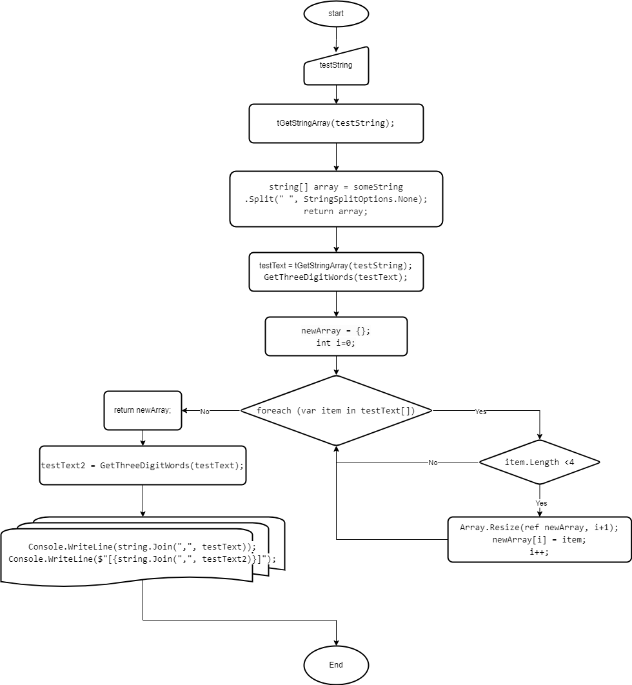

# Описание алгоритма работы кода к итоговому ДЗ:

* 1 - пользователю выводится сообщение о необходимости ввода любого текста;
* 2 - пользователь вводит в консоль текст, переменной **testString** присваивается значение равное введённому тексту;
* 3 - переменную **testString** передаём в функцию **GetStringArray** для получения одномерного массива строковых элементов. Передаём полученные элементы в массив  **testText**.  
*Заполнение массива в функции происходит посредством оператора **Split***;
* 4 - массив  **testText** передаём в функцию **GetThreeDigitWords** для получения одномерного массива строковых элементов длина которых не превышает 3 символа. Передаём полученные элементы в массив  **testText2**.  
*Внутри функции создаём пустой массив, создаём переменную-счётчик и запускаем цикл **foreach**. Внутри цикла: для каждого элемента массива-аргумента происходит проверка на длину. **Если** длина элемента массива менее 4 символов, длина нового массива увеличивается на 1, элементу массива с индексом счётчика присваивается значение текущего элемента массива-аргумента, счётчик увеличивается на 1. **Если**  длина элемента массива больше или равна 4, ничего не происходит, переходим к следующему элементу массива-аргумента. Когда в маассиве-аргументе заканчиваются элементы, цикл завершается;*
* 5 - пользователю выводится в консоль элементы массивов **testText** и **testText2**.

## Блок-схема работы кода:
  
[Блок-схема на drawio](https://app.diagrams.net/#G1ZQFXBkWx_5RnZA6Ql_plwRe1fNjwqb1_)

